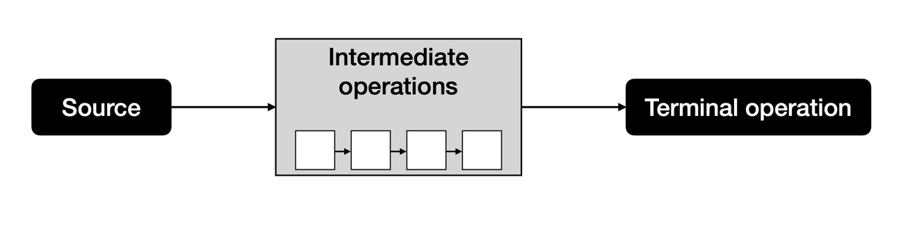

# Java Streams

## Stream Pipeline Schema

Source: Where stream starts

Intermediate Operations: Transform stream in to another stream. These do not run until the terminal operations runs.

Terminal Operation: Produce a result. After this operation stream is ended.

### Create Stream

| Method                                         | Finite               | Description                                                                                |
|------------------------------------------------|----------------------|--------------------------------------------------------------------------------------------|
| Stream.empty()                                 | Yes                  | Empty stream                                                                               |
| Stream.of(varargs)                             | Yes                  | Stream of data passed                                                                      |
| collection.stream()                            | Yes                  | Stream from collection                                                                     |
| collection.parallelStream()                    | Yes                  | Parallel stream from collection                                                            |
| Stream.generate(supplier)                      | No                   | Create dynamic stream from Supplier                                                        |
| Stream.iterate(seed, unaryOperator)            | No                   | Create stream from Supplier. Seed used as first and succeeding generated by Unary Operator |
| Stream.iterate(seed, predicate, unaryOperator) | Depends on Predicate | Same as above. Stopped when predicate returns false                                        |

